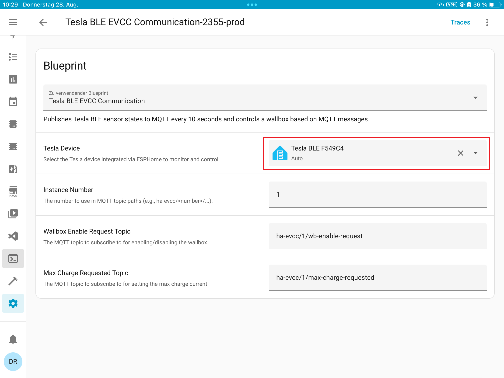

Dieser Blueprint ermöglicht die Veröffentlichung von Tesla BLE-Sensorwerten über MQTT und die Steuerung des Ladevorganges basierend auf MQTT-Nachrichten.

## Installation

1. Kopiere die folgende URL, um den Blueprint in Home Assistant zu importieren:

```
https://raw.githubusercontent.com/top-gun/EVCC-Blueprint/main/automation/tesla_evcc_mqtt.yaml
```

Gehe in Home Assistant zu Einstellungen > Automatisierungen & Szenen > Blueprints und füge die URL ein, um den Blueprint zu importieren.
Wähle dein Tesla-Gerät aus der Liste. Die weiteren Einstellungen bleiben unverändert, wenn nur ein Auto gesteuert wird. 



Um die Daten in EVCC zu nutzen, füge ein neues Fahrzeug hinzu, Typ "generisches Fahrzeug" und benutze die Einträge aus der Datei EVCCgeneric-vehicle.yaml
